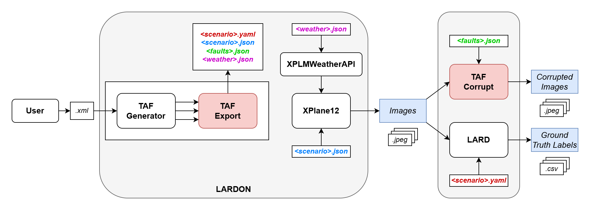

# LARDON

Outil de génération de **trajectoires d'approche réalistes aériennes** , rendues sous **X-Plane 12**, avec dégradation capteur et évaluation d'un
modèle de détection de piste.

L'outil échantillonne des scénarios sous contraintes avec **TAF** (Testing
Automation Framework, LAAS-CNRS), calcule les trajectoires d'approche et génère
les images correspondantes via X-Plane 12. Pour chaque image, il produit également
la **vérité terrain** — la position réelle de la piste projetée en 2D sur l'image
— à l'aide de **LARD** (ONERA, IRT Saint Exupéry et AIRBUS).

Sur ces images, un **modèle de détection** (choisi par l'utilisateur dans
`settings.xml`) prédit la position de la piste. Ces prédictions sont ensuite
comparées à la vérité terrain : la qualité de la détection est mesurée par l'**IoU**
(intersection sur union) entre prédiction et vérité terrain.

L'utilisateur n'a qu'à éditer des fichiers **XML** pour définir ses scénarios,
puis à lancer l'outil en ligne de commande. Deux notebooks
(`notebook/generation.ipynb` pour les 3 phases, `notebook/features.ipynb` pour
les outils annexes) sont également disponibles pour ceux qui préfèrent travailler
en interactif.

---

## Aperçu de l'outil



---

## Prérequis

| Composant   | Détail |
|-------------|--------|
| **OS**      | Compatible Windows et Linux. |
| **Python**  | Python 3.10.10. |
| **X-Plane 12** | Version **complète (payante)** obligatoire. Sinon, l'accès est limité à seulement quelques aéroports/pistes. Téléchargement : <https://www.x-plane.com/> |

---

## Installation

### 1. Cloner le projet

```bash
git clone https://gitlab.laas.fr/trust_ml_safety/LARDON
cd LARDON
```

### 2. Récupérer LARD (branche `LARD_V2`)

LARD n'est **pas** inclus dans le dépôt et **n'est pas un package pip**. Un script
le clone à la bonne version (branche **`LARD_V2`**, requise par le pont LARD) et
installe ses dépendances :

```bash
py scripts/install_lard.py
```

Équivalent manuel :

```bash
git clone -b LARD_V2 https://github.com/deel-ai/LARD
```

> ⚠️ La branche **doit** être `LARD_V2` : `main` (= `LARD_V1`) n'a pas `src/geo/`,
> les imports `from src.geo...` casseraient.
>
> LARD déjà présent ailleurs (n'importe où sur le PC) ? Indiquez son chemin
> **absolu** dans `paths.local.json` à la racine (clé `lard_dir`). Voir
> `paths.local.json.example`.

### 3. Récupérer TAF

TAF n'est **pas** inclus dans le dépôt. Depuis la racine du projet :

```bash
git clone https://redmine.laas.fr/laas/taf.git
```

*Plus de détails sur TAF : <https://wp.laas.fr/taf/download/>*

> Vous avez déjà TAF ailleurs (n'importe où sur le PC) ? Indiquez son chemin
> **absolu** dans `paths.local.json` (clé `taf_dir`).

Après les étapes 1 à 3, la racine doit contenir :

```
lardon/
├── sources/            # usine à données (génération + rendu + GT LARD)
├── scripts/            # install_lard.py, plugin météo, build templates…
├── XPlanePlugin/
├── notebooks/
├── main.py             # CLI (generate / export / full)
├── config.py           # (dans sources/) résolution des chemins externes
├── paths.local.json    # (non versionné) chemins ABSOLUS LARD/TAF/X-Plane de la machine
├── requirements.txt
└── docs/
```

> L'évaluation (YOLO/IoU) a été extraite dans un **projet séparé** : ce dépôt ne
> contient plus que l'usine à données (génération + rendu + vérité terrain).

### 4. Installer les dépendances Python

```bash
# Créer + activer l'environnement (une seule fois)
py -m venv .venv
.venv\Scripts\activate        # Windows (PowerShell / cmd)
source .venv/bin/activate     # Linux / macOS

# Dépendances de l'usine (generate + export)
pip install -r requirements.txt
```

> Alternative **uv** : voir [docs/INSTALLATION_UV.md](docs/INSTALLATION_UV.md).
> (Un `pyproject.toml` pour uv reste à ajouter — ticket @mathieu.)
>
> Pas de PyTorch ici : l'évaluation (YOLO/IoU) vit dans un projet séparé.

### 5. Installer le plugin météo dans X-Plane 12

Deux éléments distincts à installer :

1. **XPPython3** — le moteur de plugins Python pour X-Plane.
   Suivre la procédure officielle :

   > <https://xppython3.readthedocs.io/en/latest/usage/installation_plugin.html>

   Il s'installe dans : `X-Plane 12/Resources/plugins/`.

   *Note : l'API **XPLMWeather** utilisée par le plugin météo est intégrée à
   X-Plane 12 et exposée directement par XPPython3 — rien à télécharger en plus.*

2. **PI_weather.py** — le plugin météo de ce projet. Un script l'installe au bon
   endroit (et crée le dossier `PythonPlugins/` si nécessaire) :

   ```bash
   py scripts/install_weather_plugin.py
   ```

   Le script lit `xplane_dir` depuis `sources/settings.xml`.
   *(Installation manuelle équivalente : créer le dossier
   `X-Plane 12/Resources/plugins/PythonPlugins/` puis y copier
   `XPlanePlugin/PI_weather.py`.)*

Puis **recharger les scripts depuis le simulateur** : une fois X-Plane 12 lancé,
utiliser la barre de menu en haut de la fenêtre du simulateur après avoir lancé le simulateur sur une piste aléatoire :
**Plugins → XPPython3 → Reload Scripts**.

---

## Configuration de X-Plane 12

- Lancer X-Plane 12 en **mode fenêtré** (pas en plein écran). Le réglage se fait
  dans les paramètres d'affichage du simulateur. Les captures sont prises
  directement sur la fenêtre du simulateur : **laisser l'écran allumé** et la
  fenêtre X-Plane visible pendant tout le rendu (ne pas la minimiser ni la
  recouvrir d'une autre fenêtre).
- Régler la **mise à l'échelle de l'affichage (scaling) à 100 % sur l'OS (Windows ou Linux)**.
  La capture est ensuite recadrée à une résolution fixe. Si le scaling de l'OS
  n'est pas à 100 %, les pixels capturés ne correspondent plus aux coordonnées
  attendues : la **bounding box de la vérité terrain (GT LARD)** se retrouve
  décalée par rapport à la piste.

---

## Configurer un scénario : les fichiers XML

C'est la seule partie à éditer pour définir ses propres scénarios.

### Choisir le profil actif — `sources/settings.xml`

```xml
<parameter name="template_path"      type="path" value="templates/rain/" />
<parameter name="template_file_name" type="file" value="rain_heavy.xml" />
```

- `template_path` + `template_file_name` : le template XML utilisé pour la génération.

### Templates pré-générées

- `sources/templates/base.xml` — template de base (trajectoire + météo + 26 fautes).
- `sources/templates/<profil>/*.xml` — variantes météo pré-générées, profils
  `clear`, `fog`, `clouds`, `rain`, `snow`, chacun en intensités
  *light / moderate / heavy*.

### Générer ou ajouter des templates

Les variantes météo sont produites par un script de *build* à partir de `base.xml`
et d'une table de presets. Pour les régénérer (par exemple après modification de
`base.xml`) ou pour ajouter un nouveau profil :

```bash
py scripts/build_weather_templates.py
```

Pour **ajouter un scénario / dossier**, éditer la table `PRESETS` dans
`scripts/build_weather_templates.py` (clé `(sous_dossier, nom_fichier)` →
surcharges des paramètres météo), puis relancer le script : il (re)crée les XML
correspondants dans `sources/templates/<profil>/`. Les fichiers générés ne
doivent **pas** être édités à la main — ils seront écrasés au prochain build.

### Explication des templates

Un template décrit, en un seul XML, l'ensemble des contraintes d'un scénario :
trajectoire, météo, réglages de rendu et fautes capteur. TAF lit ces contraintes
et échantillonne des valeurs concrètes (via le solveur z3).

#### Convention min / max

Chaque paramètre a un `min` et un `max` :

- `min` et `max` **identiques** → valeur fixe.
- `min` et `max` **différents** → TAF échantillonne une valeur dans la plage
  (résolution sous contraintes par le solveur z3).

#### Les 4 blocs d'un template

Chaque variable est commentée directement dans le XML (`base.xml`) — se référer
à ces commentaires pour le détail de chaque paramètre.

| Bloc | Variables |
|------|-----------|
| **trajectory** | `fps`, `along_track_distance_start`, `along_track_distance_end`, `ground_speed_kts`, `turbulence_intensity`, `wind_speed_kts`, `wind_direction_deg`, `stabilization_distance_m`, `airport_runway`. |
| **weather** | `precip_rate`, `cloud_type`, `cloud_coverage`, `cloud_thickness_m`, `fog_visibility`, `temperature_c`, `rain_scale`, `cloud_margin_m`, `weather_effect_duration`. |
| **settings** | `time_of_day_h`, `load_texture_duration`, `screenshot_duration`, `weather_zone_radius_nm`. |
| **faults** | 26 types de fautes capteur. Chaque faute a `severity`, `start_pct`, `duration_pct`. Une faute est **active si `severity > 0`**, désactivée si `severity = 0`. |

#### Piste cible

Le paramètre `airport_runway` utilise le format `ICAO_RWY` (exemple : `LFPO_24`,
`KPDX_10L`). La liste des pistes disponibles se trouve dans :
`LARD/data/runways_db_V2_XPlane.json`.

#### Cas particulier : démo X-Plane 12

La version **démo** de X-Plane 12 ne charge le décor (terrain réel) que sur
quelques zones limitées — notamment **Portland (KPDX)**. Pour essayer l'outil
sans la version complète, remplacer la valeur de `airport_runway` dans le
template par les pistes de la démo présentes dans la DB LARD XP12 :

```xml
<!-- Aeroport + piste cibles (pour la demo X-Plane 12) -->
<parameter name="airport_runway" type="string"
           values="KPDX_3;KPDX_10L;KPDX_10R;KPDX_21;KPDX_28L;KPDX_28R"/>
```

> Ces 6 pistes sont vérifiées présentes dans `LARD/data/runways_db_V2_XPlane.json`.
> Hors de ces zones, la démo n'affiche que de l'eau / un terrain générique : la
> vérité terrain reste correcte (géométrie connue), mais les images n'ont pas de
> décor exploitable.

---

## Lancer l'outil

```bash
# Phase 1 — génère les scénarios (.yaml + .json poses + .esp) dans scenarios/<batch>/
py main.py generate -n 5

# Phase 2 — rendu X-Plane + fautes capteur + vérité terrain LARD
py main.py export --all --batch <batch>

# Tout enchaîner (génération + rendu)
py main.py full -n 5

# Rendu GES (externe : produit l'arborescence dataset/GES/… ; images à déposer par GES)
py main.py export --all --batch <batch> --simulator GES

# Forcer une piste précise (sinon TAF échantillonne parmi le template)
py main.py generate -n 10 --runway LFPO_24
```

Où `<batch>` est le dossier créé par `generate` (format `<nom|default>__<timestamp>`,
affiché en fin de génération).

> En mode `--all`, l'option `--batch <nom>` est obligatoire. Pour cibler un seul
> scénario : chemin composé, ex. `export <batch>/<scenario_name>`.

**Référence complète des commandes** : voir [COMMANDES.md](docs/COMMANDES.md).

Le chemin X-Plane 12 est résolu par `config.py` (clé `xplane_dir` de
`paths.local.json`). L'option `--xplane-dir` le surcharge
ponctuellement. Ce répertoire ne sert qu'à localiser le plugin météo ; le
positionnement et la capture d'images n'en dépendent pas.

---

## Résultats

`generate` et `export` produisent **deux arbres distincts** :

```
scenarios/                              sortie de 'generate' (Phase 1)
└── <batch>/                            <nom|default>__<timestamp>
    └── <scenario_name>/                <airport>-<runway>__<nb>-smpl__<ts>__<i>
        ├── <scenario_name>.yaml        scénario LARD (TAF)
        ├── <scenario_name>.json        poses caméra
        ├── <scenario_name>.esp         projet GES (best-effort, si LARD dispo)
        ├── fault_profile.json          profil fautes capteur (si actif)
        └── weather_profile.json        profil météo X-Plane (si actif)

dataset/                                sortie de 'export' (Phase 2)
└── <simulator>/                        xplane | GES
    └── <airport_runway>/               ex: KPDX_10L
        └── <scenario_name>/
            ├── images/                 rendu simulateur
            ├── corrupted_images/       images + fautes capteur (si actives)
            └── metadata.csv            vérité terrain LARD (GT)
```

### Aller plus loin avec les notebooks

Deux notebooks dans le dossier `notebooks/` :

- **`notebooks/generation.ipynb`** — reproduit les phases `generate` / `export`
  depuis des cellules, sans passer par la ligne de commande.
- **`notebooks/features.ipynb`** — fonctionnalités complémentaires (datasets,
  vidéo, `params_trace.xml`, `xplane_config.json`, visualisation des bounding
  boxes GT LARD `lard_box/`).

> Note : certains helpers de `notebooks/features.ipynb` ciblent encore l'ancien
> layout (`runs/`, `footage/`) et doivent être adaptés au nouveau layout.
